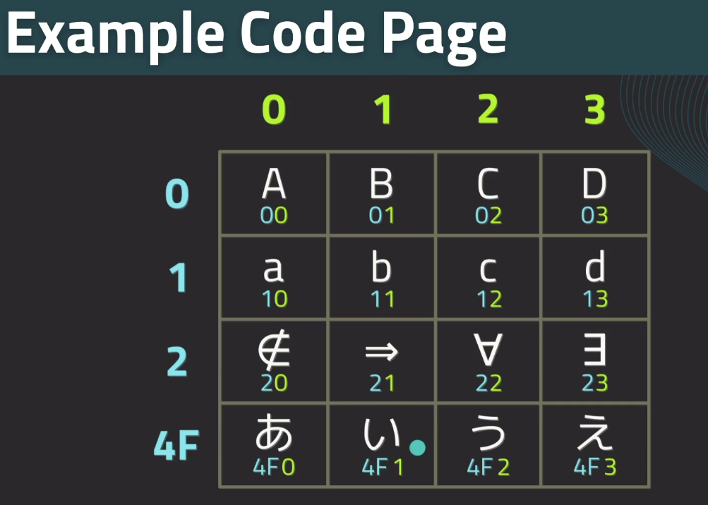

# golang_ztm

- Go programming language created at google to solve google sized problems , at the end we will create a cross - platform desktop app called pixel to create and edit pixel art.
- You can find all of the course projects, code, slides in the [repository](https://github.com/jayson-lennon/ztm-golang). You can use this as a guide as you go through the course, learn Go, and build projects!
- Go is an In-demand language used by high-profile companies such as google. It's simplistic and easy to understand by design. It has built-in dependency management including a package registry similar to the javascript NPM ecosystem. it also has a familiar c style syntax.
- Technical features : It has first-class concurrency primitives and makes it perfect for backend programming such as making web servers. Has type safety which is enforced by the compiler. It's a memory safe language , accomplishes by garbage collection - no need to manage memory . Go compiles down to machine code for very fast speeds , so your programs will always run extremely quickly. Garbage collection overhead is very minimal.
- we will be working with Go CLI which is used to manage your project and we will be utilizing Go package ecosystem and it's generated documentation. Since Go is a lower level language , we'll cover concepts such as pointers, memory and concurrency.
- let's learn this language to solve a problem where we want to do some performance tuning for a company services. we're given a task to rewrite the company services to be more efficient. So this is first time optimizing applications , how can we increase the efficiency of company services? . we learn Go programming language, which was designed to build efficient services. We better get to work.

---

## Installation of Go toolchain and VSCode Extensions.

- let's go to [go.dev](https://go.dev/) & click on downloads and pick your operating system and click on that link to download the installation file.Then install.click Finish.Now your `Go toolchain` is ready to run.
- Launch VSCode -> Go to Extensions -> Install `Go` -> `After you install the Go extension, the popup should appear whenever you open a .go file. If this doesn't happen, then you can use CTRL+SHIFT+P to bring up the command window, type in go update,  check the boxes for go-outline, staticcheck, and gopls then click OK. it will then install the tools. or check all and install-all from the prompt.` In the Output bar we will see the installed things as follows:

```
2024-12-14 12:04:24.115 [info] Installing 4 tools at C:\Users\abhis\go\bin
2024-12-14 12:04:24.115 [info]   gopls
2024-12-14 12:04:24.115 [info]   goplay
2024-12-14 12:04:24.115 [info]   dlv
2024-12-14 12:04:24.115 [info]   staticcheck
2024-12-14 12:07:42.456 [info] Installing 3 tools at C:\Users\abhis\go\bin
2024-12-14 12:07:42.456 [info]   gotests
2024-12-14 12:07:42.456 [info]   gomodifytags
2024-12-14 12:07:42.456 [info]   impl
...
..
.
2024-12-14 12:08:07.992 [info] All tools successfully installed. You are ready to Go. :)
```

---

### Packages & Modules - Data Types - Strings/Runes

- packages and modules will be encountered as soon as you start writing Go code.It's important to have an understanding of how they work.

  - packages are Go's way of organizing code.Programs are written as one or more packages.Packages can be imported from Go package registry.Packages should be focused and perform a single thing.Good packages examples : Argument parsing, Drawing graphics. Handling HTTP requests.For each one of these packages, you would just want it to do the single task that it was designed for.And if you needed to do something else, you can just create a new package.
  - To use a package , all we need to do is write the `import` keyword in our code followed by the name of the package within double quotes. `import ( . "name" , pk "namespace/packageName")`.
  - modules are collection of packages.Created by having a `go.mod` file in the root directory of your project. can be managed by the Go CLI. Contains information about your project which includes dependencies, Go Version, package info. All Go projects have a `go.mod` file

  ```
  module example.com/practice <!-- we have module keyword followed by name of the module   -->

  go 1.17 <!-- Go version -->

  require(
    github.com/alexflint/gp-arg v1.4.2
    github.com/fatih/color v1.13.0
  ) <!-- Require Block each one of the lines is going to be a package along with the version we're using within our code , color is the name of the package and github.com/fatih is namespace  -->
  ```

- Data Types Explained : All data in programs consists of binary numbers (0 or 1). A Data type is a way that the program can interpret the binary numbers. Numbers - 15 , letters - y and words - hello are all different data types.
  - Go is a statically typed language. Data types must be provided by the programmer.Go uses type inference to determine what type of data it is working with means Data types only need to be provided in specific circumstances.Can always specify the type if desired.Compiler error if wrong type is used.This is how Go compiler is able to provide type safety.
  - In Go , all primitive data types are numeric. This means that they're simply a stream of bytes.The type indicated in the code is simply a convention.It's possible that the data is invalid for the given type.Only applies when working with user input or manually manipulating the binary data.Go uses static typing, which is checked at compile time.Type aliases can be created to give new names to existing types. `type UserId int` , converting between types requires parentheses `UserId(5)`. the compiler uses `Type inference` which automatically determines which types to use.
- Strings/Runes :
  - Text Encoding -> Textual data in Go uses UTF-8 encoding. Encoding is a way to represent thousands of different symbols using code pages. code pages are tables which use the first few bytes of data to determine which page to use. Each symbol in the code page is called a code point.From the below image , if we look at lowercase `d` here , we'll see that we're at code point one and three , so create `d` it actually takes two bytes in this case and to create japanese characters it takes 3 bytes..etc
    
  - In Go , when working with strings and runes , we're actually working with individual bytes , not letters themselves. so it's important to understand letters can consume more than one byte.
  - Text in Go is represented using the Rune type.similar to char like in c.Rune is an alias for int32 , which is just a 32-bit integer.means you're actually just working with numbers whenever you're working with Rune.(Always a number: will print numeric value unless proper formatting is specified).Runes can represent any symbol and this includes letters,numbers and emoji.
  - A String is a data type for storing multiple runes.Strings are just an array of bytes and a string length. There is no null termination with a Go String.When iterating a string, iteration occurs over bytes and bytes are not symbols. special iteration techniques are required to retrieve runes/symbols.
  - Creation : Runes -> '1','w',`&` and Strings : "Amount is jabsdjk" AND rAW lITERAL: `Let's code in "Golang"\n`

### Go CLI

- Go toolchain provides the go command line utility. This tool is used to: Update dependencies , Build and test projects , Manage artifacts , Format source code.
- Everyday Go Commands:
  - build : builds the project & emits an executable binary ( build is the command you'll want to use when you want to distribute your project )
    - build -race : checks for concurrency problems
  - run : runs the projects directly; no output executable
  - mod : manages modules & dependencies
    - mod tidy : updates dependencies
  - test : runs the project's test suite
  - fmt : formats all source files(usually automated with IDE)

### Go Programming Fundamentals

- variables
- functions
- operators
- if..else
- Loops - while - infinite

### Go programming : Types

- `Structures` - allows data to be stored in groups , Similar to "class" in other programming languages. Each data point in the structure is called a `field`.Storing data in groups is usually more efficient. Possible to associate functionality with structures.Helps organize code and data.
- `Arrays` - Arrays are a way to store multiple pieces of the same kind of data.Each peice of data is called `Element`.To access items in the array, an array index is used.Arrays are fixed size and cannot be resized.
- `Slices` - Slices are companion types that work with arrays.They enable a "view" into an array.Views are dynamic and not fixed in size.Functions can accept a slice as a function parameter.any size array can be operated upon via slice.Slice takes a minimal ammount of memory.It just has an address that points into this existing array.you're not making a copy.All you're doing is having some metadata that just peeks into that original array which remains untouched.
- ranges
- `maps` - Maps are a commonly used data structure that stores data in Key-value pairs - Extremely high performance when the key is known - Unordered - data is stored in random order.
- `pointers` - Memory: Function calls in Go are "pass by value". A copy of each function argument is made, regardless of size.Potentially slow for large data structures.More difficult to manage program state.This can be changed by using pointers. pointers are variables that `"point to"` memory . The value of the variable itself is a memory address.Accessing the data requires `dereferencing` the pointer.This allows changing values that exist elsewhere in the program.Creating pointer: `Asterisk(*)` "when used with a type" indicates the value is a pointer.`Ampersand(&)` creates a pointer from a variable.

```
value := 10
var valuePtr *int //create a pointer to an integer
valuePtr = &value // pointer to value - will have memory address and points to value variables.
```
